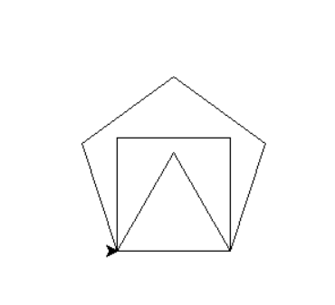
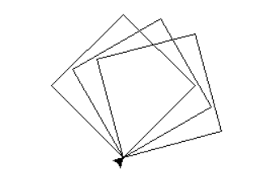

# turtle_square
Esta práctica busca demostrar cómo usar la biblioteca turtle.

### **`turtle_square.py`**:
El objetivo de la práctica es dibujar tres formas geométricas: un cuadrado, un triángulo y un pentágono. Cada forma se dibuja utilizando una función específica que traza los lados de la figura con un tamaño y ángulo determinados, para lograr esto es necesario implementar la definición de funciones específicas para cada forma y la repetición de comandos básicos de dibujo:

    

### **`turtle_square2.py`**:
Dibuja tres cuadrados rotados. Cada cuadrado se dibuja girando 15 grados antes de comenzar a trazar el siguiente, creando un efecto de rotación, demostrando la capacidad de rotar y dibujar figuras geométricas en secuencia:

    

